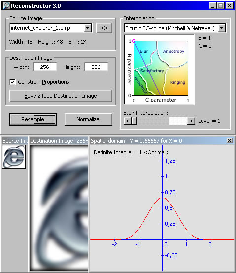



## Reconstructor 3\.0

### Description

Shows various image resampling (resizing) area interpolations like: Nearest Neighbor (Box, Point), Bilinear (Triangle, Tent, Bartlett), Bicubic cardinal spline, Bicubic B-spline, Bicubic BC-spline (Mitchell & Netravali) with an interactive diagram, Bell, Gaussian and Windowed Sinc with these windows: Bartlett, Blackman, Blackman-Harris, Bohman, Connes, Cosine, Gaussian, Hamming, Hann, Kaiser, Lanczos, Parzen, Rectangular, Welch. All interpolation filters are shown in spatial domain. Stair interpolation and normalization are also supported. Everything is developed under Visual Basic using SafeArray technique to access image pixels. Application is also able to extend edges if the filter demands that by copying edges content out of bounds. Sample pictures are included.
 
### More Info
 

             |
---                |---
**Submitted On**   |2003-06-21 14:20:12
**By**             |[Petr Supina](https://github.com/Planet-Source-Code/PSCIndex/blob/master/ByAuthor/petr-supina.md)
**Level**          |Intermediate
**User Rating**    |5.0 (140 globes from 28 users)
**Compatibility**  |VB 6\.0
**Category**       |[Graphics](https://github.com/Planet-Source-Code/PSCIndex/blob/master/ByCategory/graphics__1-46.md)
**World**          |[Visual Basic](https://github.com/Planet-Source-Code/PSCIndex/blob/master/ByWorld/visual-basic.md)
**Archive File**   |[Reconstruc1607436292003\.zip](https://github.com/Planet-Source-Code/petr-supina-reconstructor-3-0__1-46515/archive/master.zip)

